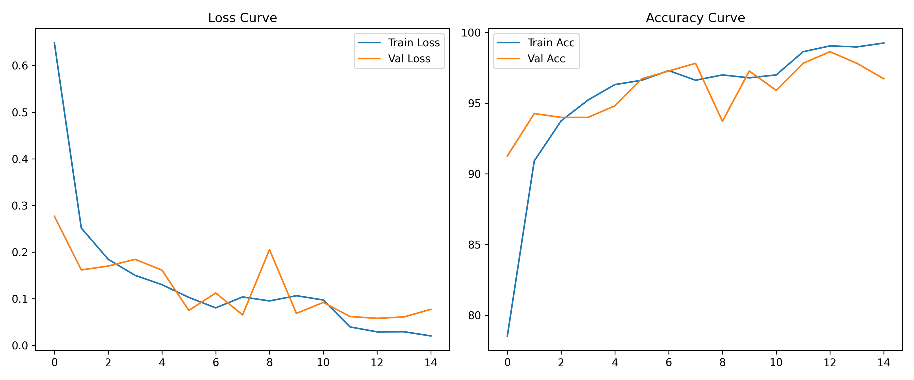
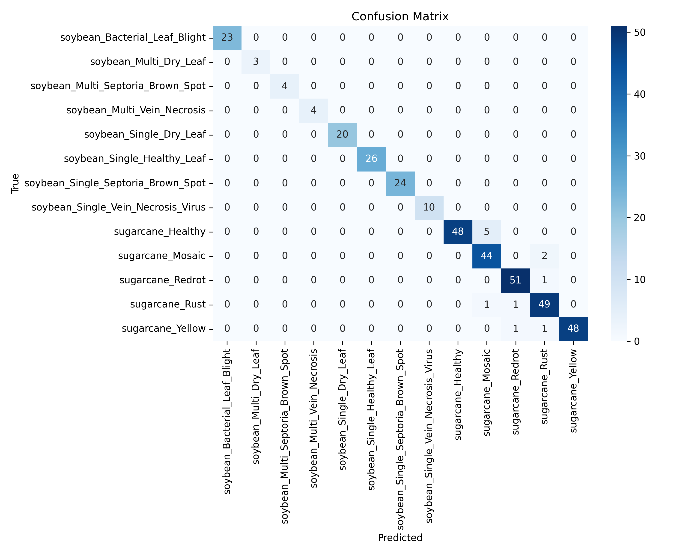

# 🌱 CropGuard AI – Crop Disease Detection & Advisory System

**Best AI Innovator Award Entry** | Seamedu Awards 2026

[](https://www.python.org)
[](https://pytorch.org)
[](https://streamlit.io)
[](LICENSE)

**98.63% Validation Accuracy** on real Maharashtra farm images (Soybean + Sugarcane)

---

## 🎯 Problem Statement
Farmers in Maharashtra (Pune, Satara, Ahmednagar, Solapur, Nashik) lose 20–30% of their soybean and sugarcane crops every year due to late detection of diseases. Manual inspection is slow, expensive, and not scalable.

**CropGuard AI** is a deep learning solution that identifies **13 different crop diseases** from a single leaf photo in seconds and provides localized farmer advisory.

---

## ✨ Key Features
- Real-time leaf disease classification (Soybean + Sugarcane)
- 98.63% validation accuracy
- Simple, farmer-friendly web interface (Streamlit)
- Personalized advisory for Maharashtra region
- Lightweight model (EfficientNet-B0) → easy to deploy on mobile/edge
- Fully reproducible training pipeline

---

## 📊 Results
- **Best Validation Accuracy**: **98.63%**
- Final Epoch: Train Acc 99.25% | Val Acc 96.72%
- Trained on **3,658 real farm images** collected from Maharashtra




---

## 🛠️ Model Architecture
- **Base Model**: EfficientNet-B0 (pre-trained on ImageNet)
- **Transfer Learning**: First 6 MBConv blocks frozen
- **Classifier Head**: Dropout(0.2) + Linear(1280 → 13)
- **Input**: 224×224 RGB images
- **Total Trainable Parameters**: ~1.2 million

---

## 📁 Dataset
- **Soybean Leaf Disease Dataset** (Maharashtra farms) – Mendeley
- **Sugarcane Leaf Disease Dataset** (Pune district) – Mendeley
- Total: **3,658 images** across **13 classes** after cleaning & filtering

---

## 🚀 How to Run the Project

### 1. Clone the Repository
```bash
git clone https://github.com/AmarjeetJha17/CropDiseaseAI.git
cd CropDiseaseAI
